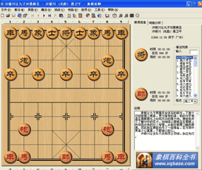
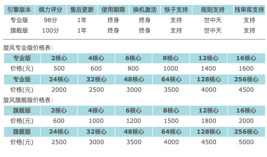
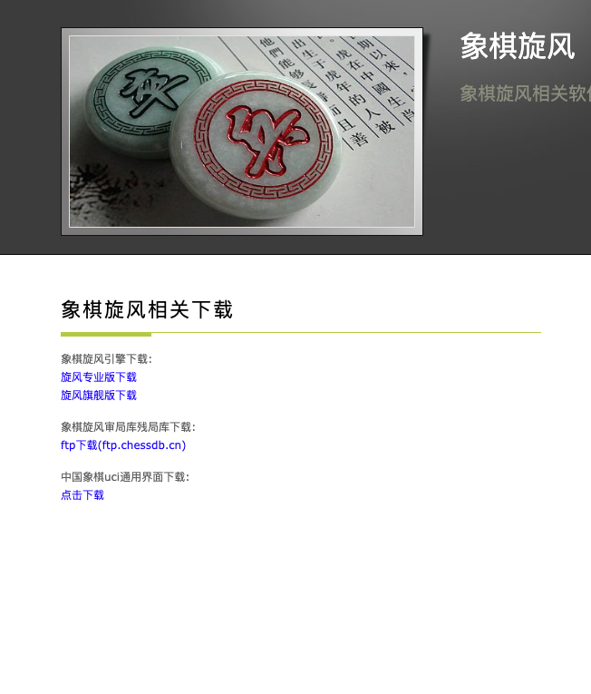

---

marp: true
theme: gaia
title: Eric's Favourite Technology
class: 
- lead

---

# CCYCLONE

## Top 1 Chinese Chess AI

---

## Founding Company:

 

### Ccyclone, or in Chinese: [**象棋旋风**](http://www.ccyclone.com/)

---

# What Can It Do?

## -**DESTROY** any human chess player and beat them to **PULPS**, such as...

---

## Bowen Gu

 - national teenager champion
 - national chess master

 Bro seems about to cry in front of _Ccyclone_

---

## Jing Xie

- national champion
- the last student of _Ronghua Hu_, top 1 chess player in history

---

## Mr. Ubial 
(blurred pic represents mystery)

- **coolest** staff member at an aquarium called SLSS
- the only man who could still smile when confronting _Ccyclone_

---

# Location of Ccyclone's Main Office

- Beijing, China, Virgo Cluster

---

# Competitors?
## -Surely there are

- [Chess Wizard](https://www.xqbase.com/) - by the same developer actually
- [King Chess](https://kingxiangqi.cn/)
- [Pikafish](https://pikafish.org/)

---

 

## Some **COOL** Facts
1. Chen, the developer of _Ccyclone_, was actually a university student when he cooked this
2. Chen himself is a **huge** fun of Chinese chess 
3. Chen developed _Ccyclone_ because he always lost to some online chess players🤣

---
## On to Pricing...

### varies from _$100~$1000_, based on how badly it will beat you up

---

## Now let's get it and use it to play with our friends

### - also the reason why I love it (lol)

Just go ahead and use [this link](http://www.ccyclone.com/download.html#) to download this **goat**
(You're welcome and thanks for watching all these crazy stuff)